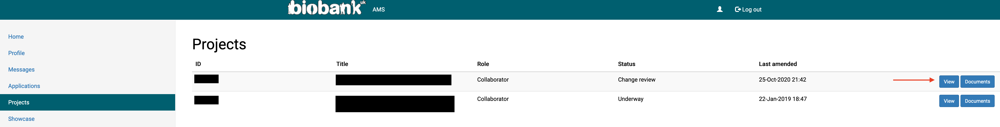
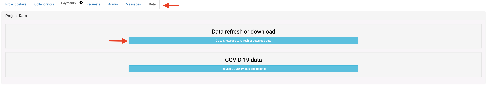
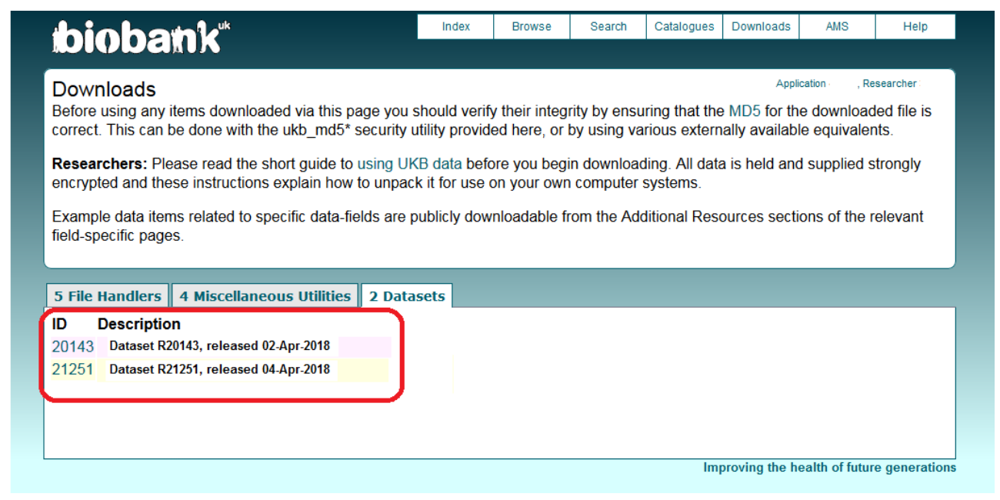
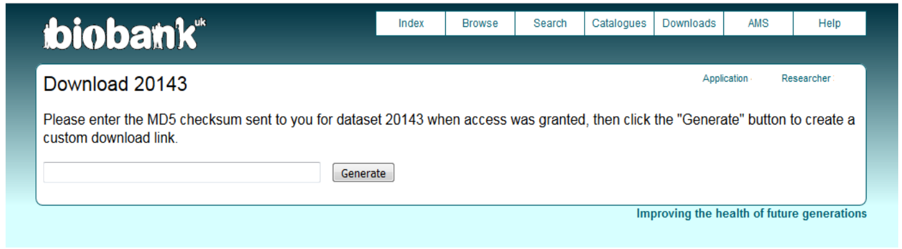
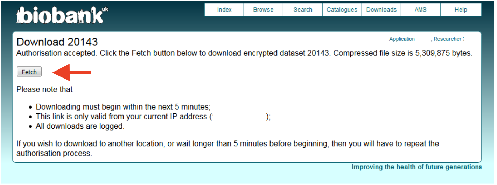
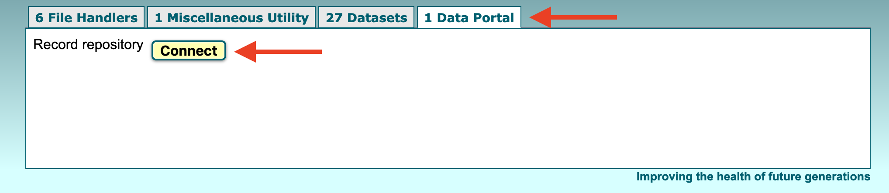
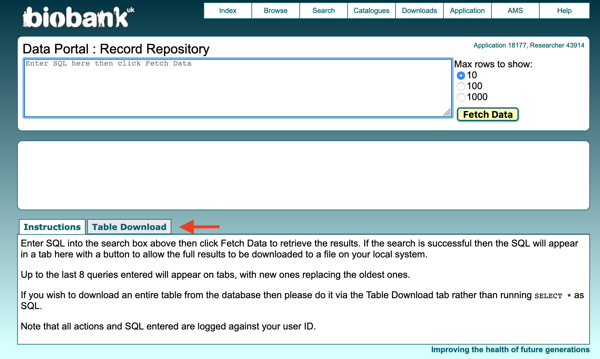
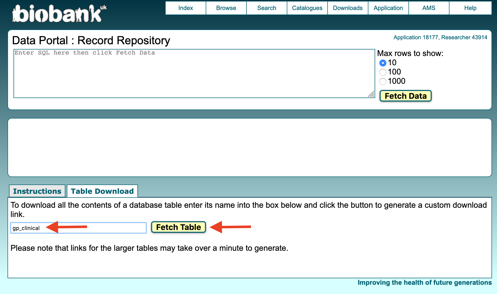

# Initialize new application
In this section, we will go through now to organize new applications. 

## Before you start
Make sure you have the following

1. `nextflow`

    !!! note
        You can install nextflow with 

        `curl -s https://get.nextflow.io | bash`

        Java 8 or later is required
2. A md5 key file for one UK Biobank application
    - This is required so that we can download the sample ID 

## Generating the application folder
1. Assuming you are in the UK Biobank directory initialized from [previous section](init_structure.md), run the following
    ```
    sh scripts/administration/new_application.sh \
        --key <Your key file> \
        --id <UK Biobank application ID>
    ```

## Data structure
After running the script, a new folder named `ukb<application ID>` should appear under the `application` folder.
This folder should have the following structure:

```
ukb<application ID>
  |
  |-- genotyped 
  |
  |-- imputed
  |
  |-- exome
  |    |   
  |    |-- PLINK
  |
  |-- phenotype
  |    |
  |    |-- raw
  |    |    |
  |    |    |-- encrypted
  |    |    |
  |    |    |-- keys
  |    |
  |    |-- withdrawn
  |    |
  |    |-- ukb<application ID>_rel_s488251.dat # This is the relatedness file
  |
  |-- ukb<application ID>_init.log
```

You will only have the `genotyped`, `imputed` or the `exome` folder if your application has permission to access them.

## Getting the phenotype files
UK Biobank does not provide a command line option to download the phenotype files. 
As such, the delegate of each application will need to download and upload the phenotype files manually.
Here we will go through the steps involved 

### Downloading phentype files
The encrypted dataset must be access via the UK Biobank Access Management System (AMS).

!!! note
    Only project Principal Investigator (PI) or collaborators with delegate access are able to perform the following steps

To download a dataset, you need to follow these steps

1. Login to the [AMS](https://bbams.ndph.ox.ac.uk/ams/)
2. Navigate to the projects tab and click the view button next to the relevant application ID.  
3. Select data tab at the top right, and then click “Go to Showcase to refresh or download data”. 
4. Your dataset will be shown in the dataset tab. 
5. Click on the ID for the dataset you wish to download, which will take you to the authentication screen. 
6. Enter the 32-character MD5 checksum (included  in  the main  body of the notification email for the dataset). Then click Generate.
7. This will open a new page with a link  to your dataset. Click the Fetch button to download the encrypted dataset.
8. Upload the encrypted file to `ukb<application ID>/phenotype/raw/encrypted`. Also put the md5 key to `ukb<application ID>/phenotype/raw/keys`

### Downloading Primary Care Records
The primary care records are stored in the data portal. To download these data, you need to follow these steps


1. Login to the [AMS](https://bbams.ndph.ox.ac.uk/ams/)
2. Navigate to the projects tab and click the view button next to the relevant application ID.  
3. Select data tab at the top right, and then click “Go to Showcase to refresh or download data”. 
4. Select data portal from the top right, then click Connect. 
5. Select table download. 
6. Type in the table you want to download and click "Fetch Table". 

    !!! note
        These tables might be of interest

        - `gp_clinical`: Clinical event records 
        - `gp_scripts`: Prescription records

7. Click the link to download the table. 
8. Upload the downloaded file(s) to `ukb<application ID>/phenotype/raw/`.

!!! tips
    You can find details of primary care record [here](https://biobank.ndph.ox.ac.uk/showcase/showcase/docs/primary_care_data.pdf)