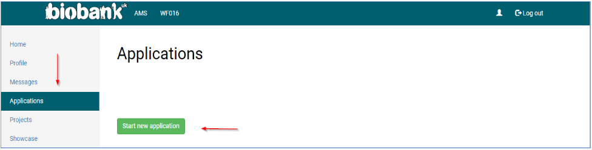

# New Application

To start a new application, you need to complete the online application form. A PDF version of this form is available via the [UK Biobank website](https://www.ukbiobank.ac.uk/wp-content/uploads/2019/09/Access-Application-Form-Template.pdf) for information purpuses. This PDF can be especially useful while preparing a new application. 

Once the researcher has been approved, a number of new tabs are visible on the left-hand panel of the AMS Home Page. To start a new application, select the 'Applications' tab and 'Start new application':

Once your application is complete, you can submit by pressing the appropriate button at either the top or bottom of the screen. Alternatively, you can save your application as a draft to return to at a later date by pressing 'Save and continue later'. If you wish to abandon your application, you can do so by pressing 'Cancel' and changes will not be saved. 

!!! note
	The researcher submitting an application is automatically assigned as ‘Applicant Principal Investigator (PI)’ to the proposed research project and they are required to sign a Material Transfer Agreement (MTA) before data is released.
