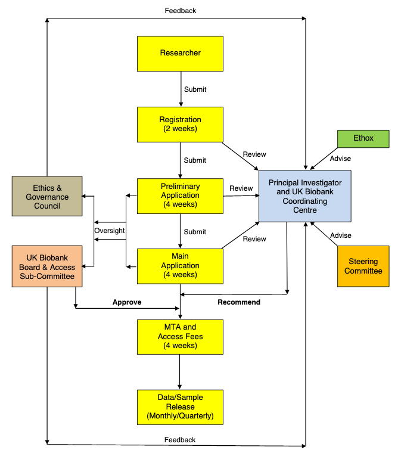

# The UK Biobank Access process

There are 5 stages that must take place before you can access the UK Biobank Resource:

1. **Registration:** To confirm the identity of each researcher intending to use the Resource, to check their bona fides before registering them as a potential user.

2. **Application:** To allow UK Biobank to assess: (i) whether the proposed research is likely to be approved; (ii) whether the proposed research meets the required criteria for access (including legal and ethics standards); (iii) whether the Resource contains the data and/or samples required for theproposed research; (iv) whether the amount of depletable sample required is scientifically justified; (vi) the cost of providing such data and/or samples.

3. **Access Sub-Committee (ASC) review:** The ASC is a sub-committee of the UK Biobank Board, and is responsible for making key access decisions, notably those regarding the use of depletable samples, recontactor potentially contentious research. The ASC meets on a quarterly basis.

4. **Material Transfer Agreement (MTA):** For approved applications, the MTA needs to be executed and access charges paid beforere lease of data and/or samples to the Applicant Principal Investigator (PI).

5. **Sample / Data Release:** Materials will only be released after payment and execution of the MTA. Data is typically released on a weekly basis, whereas samples are released to an agreed timetable.

We encourage you to read the [UK Biobank Access Management System User Guide](https://www.ukbiobank.ac.uk/wp-content/uploads/2019/09/Access_019-Access-Management-System-User-Guide-V4.0.pdf) for detailed information on getting started with the UK Biobank resource. 

The following figure shows the stages in the application and review process (with  the indicative timelines in parentheses). For further details and the roles of the different parties in the application and review process, visit [the official UK Biobank documentation.](https://www.ukbiobank.ac.uk/wp-content/uploads/2012/09/Access-Procedures-2011-1.pdf)

