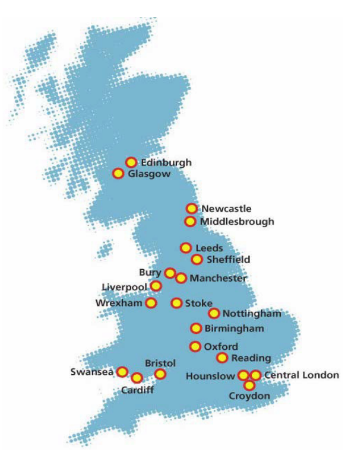

# Introduction to UK Biobank
## Introduction

The UK Biobank is a very large population-based prospective study that includes detailed health-related and genetic data on about 500,000 individuals and is available to the research community. Men and women aged 40-69 years were recruited during 2006-2010 across 22 recruitment centers in the United Kingdom (Figure 1). Participants provided general consent for all types of health research by both academic and commercial researchers and follow-up through health-related records.

The UK Biobank is funded by the Medical Research Council, Wellcome Trust, British Heart Foundation, Diabetes UK, Department of Health, Cancer Research UK, Welsh Government, Scottish Government, and Northwest Regional Development Agency. UK Biobank is supported by the National Health Service (NHS).

 
<figcaption>Figure 1. The UK Biobank cohort recruitment centres </figcaption>

## The aims of the UK Biobank cohort

- To allow detailed investigations of genetic and non-genetic determinants of disease of middle and old age. UK Biobank provides extensive and precise assessments of exposures with comprehensive follow up and characterization of many different health-related outcomes.

- To promote innovative science by maximizing access to the resource. UK Biobank is open to bona fide researchers an    ywhere in the world, including those funded by academia and industry.

!!! note 
	The age range was based on compromise to get people without a disease, and to get significant health outcomes during early years of follow up. This prospective approach enables the measurement of risk factors before the disease develops, and therefore 1) avoids reverse causality and recall bias, 2) improves measurement detail, 3) reduces measurement error. 

## Participants demographics

*TO DO: Probably nicer to do some plots with this data???*

- 	46% male
-	57% aged 40-59 years; 43% aged 60-69 years
-	*Less socioeconomically deprived than UK average*, but all strata represented
-	85% urban
-	94.5% white; 5.5% other
-	58% paid employment/ self employed
-	89% recruited in England; 7% in Scotland; 4% in Wales

## Current and planned data for UK Biobank

We encourage to visit [this website](https://biobank.ctsu.ox.ac.uk/crystal/exinfo.cgi?src=timelines_all) for the most updated information and timelines about data availability. 

|  |     NUMBER OF PARTICIPANTS   |  DETAILS  |   DATE OF DATA ACQUISITION   |   DATA FIRST AVAILABLE FOR RESEARCH |
|-----------------------------------------------------|--------------------------------------------------------|----------------------------------------------------------------------------------------------------------------------------------------------------------------------------------------------------------------------------------------------------------------------------------------------------------------|---------------------------------|------------------------------------------|
|     **UK BIOBANK ASSESSMENT CENTRE**                |                                                        |                                                                                                                                                                                                                                                                                                                |                                 |                                          |
|     UKB Baseline assessment                         |     Whole cohort                                       |     - Socio-demographics and lifestyle factors collected   with touchscreen questionnaire and brief verbal interview.     - Physical measurements (blood pressure, arterial   stiffness, eye measures, body composition, hand-grip strength, ECG, etc).     - Collection of blood, urine and saliva samples    |     2006-2010                   |     Q2 2012                              |
|     Repeat of baseline assessment                   |     20,000 to 25,000                                   |     Same as above. [Link to UKB](https://biobank.ctsu.ox.ac.uk/~bbdatan/Repeat_assessment_doc_v1.0.pdf)                                                                                                                                                                                                               |     2012-2013                   |     Q3 2013                              |
|     **ONLINE FOLLOW-UP**         |                                                        |                                                                                                                                                                                                                                                                                                                |                                 |                                          |
|     Online 24-h dietary recall web questionnaire    |     210,000                                            |     Detailed questions on the intake of foods and beverages consumed during the previous 24-hour period. [Link to UKB](https://biobank.ctsu.ox.ac.uk/crystal/crystal/docs/DietWebQ.pdf)                                                                                                                               |     2011-2012                   |     Q2 2013                              |
|     Digestive health                                |     ~180,000                                           |     Questionnaire with self-reported information on abdominal and associated symptoms for the study of Irritable bowel syndrome and related disorders. [Link to UKB](https://biobank.ctsu.ox.ac.uk/crystal/crystal/docs/digestive_health.pdf)                                                                         |     2017                        |     2018                                 |
|     Food (and other) preferences                    |     ~180,000                                           |     Questionnaire with items reflecting both sensory preferences (bitter, sweet etc.) and foodstuff preferences (fruit, vegetables, meat, etc.) [Link to UKB](https://biobank.ctsu.ox.ac.uk/crystal/crystal/docs/foodpref.pdf)                                                                                        |     Q4 2019                     |     Q1 2020                              |
|     Physical activity data with accelerometry       |     100,000                                            |     Wrist worn tri-axial accelerometer - type, intensity, and duration of PA; one-week test. [Link to UKB](https://doi.org/10.1371/journal.pone.0169649)                                                                                                                                                              |     2013-2015                   |     2015                                 |
|     Online ‘Healthy Work questionnaire’             |     100,000 – 120,000                                  |     Occupational history since finishing full time education; respiratory health outcomes and medication for these conditions; and smoking habits. [Link to UKB](https://biobank.ctsu.ox.ac.uk/crystal/crystal/docs/OccupHealthOSCAR.pdf)                                                                             |     Q3 2015                     |     Q2 2017                              |
|     Questionnaire on cognitive function             |     100,000 to 120,000                                 |     Tests for mood, fluid intelligence, trail making, symbol digit substitution pairs matching, numeric memory. [Link to UKB](http://biobank.ctsu.ox.ac.uk/crystal/label.cgi?id=116)                                                                                                                                  |                                 |                                          |
|     Questionnaire on mental health                  |     ~160,000                                           |     Questionnaire on life-time experiences of mental disorders. [Link to UKB](https://biobank.ctsu.ox.ac.uk/crystal/crystal/docs/mental_health_online.pdf)                                                                                                                                                            |     2016                        |     Q3 2017                              |
|     **IMAGING**                                     |                                                        |                                                                                                                                                                                                                                                                                                                |                                 |                                          |
|     Multimodal imaging                              |     Goal: 100,000. ~40k available as of early 2020     |     MRI - Brain, heart, abdomen, bone densitometry (DXA)                                                                                                                                                                                                                                                       |     pilot from 2014-            |     2015                                 |
|     **HEALTH RECORD LINKAGE**                           |                                                        |                                                                                                                                                                                                                                                                                                                |                                 |                                          |
|     Death registrations                             |     Whole cohort                                       |     ICD coded cause specific mortality                                                                                                                                                                                                                                                                         |     2006-                       |     Q2 2013                              |
|     Cancer registrations                            |     Whole cohort                                       |     ICD coded cancer diagnoses                                                                                                                                                                                                                                                                                 |     1981-                       |     Q2 2013                              |
|     Hospital inpatient episodes                     |     Whole cohort                                       |     ICD coded diagnoses                                                                                                                                                                                                                                                                                        |     1997-                       |     Q2 2013                              |
|     Hospital outpatient episodes                    |     Whole cohort                                       |     Limited ICD and procedure codes                                                                                                                                                                                                                                                                            |     2003-                       |     2015                                 |
|     Primary care                                    |     Whole cohort                                       |     Read-coded information including diagnoses, measurements, referrals. Prescriptions.                                                                                                                                                                                                                        |     variable                    |     Q3-4 2017                            |
|     **GENETIC DATA**                                |                                                        |                                                                                                                                                                                                                                                                                                                |                                 |                                          |
|     Genotyping (baseline samples)                   |     Whole cohort                                       |     50,000 participants genotyped using the UK BiLEVE array and 100,000 participants   genotyped on the UK Biobank array. [Link to QC and imputation details.](https://doi.org/10.1101/166298)                                                                                                                         |     2013-2015                   |     Q3 - 2017                            |
|     Exome sequencing                                |     50,000 – Whole   cohort planned Q4 2020            |     gVCF and CRAM files for 49,960 exomes available. [Link to Exome-seq FAQs](https://www.ukbiobank.ac.uk/wp-content/uploads/2020/06/UK-Biobank-50k-Exome-Release-FAQ-June-2020.pdf). Joint-call exome data in pVCF format, sample-level variant (VCFs) and sequence data (CRAMs) for the first 200k exomes planned for November 2020                                                                                                                                            |                                 |     Q4 - 2019                            |
|     Whole genome sequencing                         |     Whole cohort planned Q4 2022                       |    For more information on the release of whole genome sequencing data click [here.](https://www.ukbiobank.ac.uk/2019/09/uk-biobank-leads-the-way-in-genetics-research-to-tackle-chronic-diseases/)                                                                                                                                                                            |     TBA                         |     TBA                                  |
|     **BIOCHEMICAL DATA**                            |                                                        |                                                                                                                                                                                                                                                                                                                |                                 |                                          |
|     Serum biomarker data                            |     Whole cohort                                       |     Urine, packed red blood cells (PRBC) and serum assay data for all participants. [Link to UKB](https://biobank.ndph.ox.ac.uk/showcase/showcase/docs/serum_biochemistry.pdf)                                                                                                                                        |     2006-2010 and 2013          |     Q1 2019                              |

