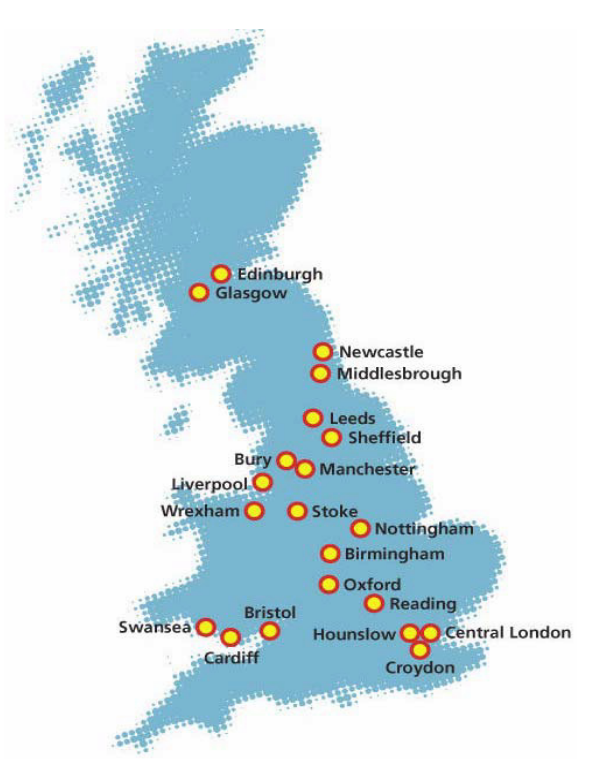

# Getting started to UK Biobank
## Introduction

The UK Biobank is a very large population-based prospective study that includes detailed health-related and genetic data on about 500,000 individuals and is available to the research community. UK men and women aged 40-69 years were recruited during 2006-2010 across 22 recruitment centers (Figure 1). Participants provided general consent for all types of health research by both academic and commercial researchers and follow-up through health-related records.

The UK Biobank is funded by the Medical Research Council, Wellcome Trust, British Heart Foundation, Diabetes UK, Department of Health, Cancer Research UK, Welsh Government, Scottish Government, and Northwest Regional Development Agency. UK Biobank is supported by the National Health Service (NHS).

<center>
 
<figcaption>Figure 1. The UK Biobank cohort recruitment centres </figcaption>
</center>

## The aims of the UK Biobank cohort

- To allow detailed investigations of genetic and non-genetic determinants of disease of middle and old age. UK Biobank provides extensive and precise assessments of exposures with comprehensive follow up and characterization of many different health-related outcomes.


- To promote innovative science by maximizing access to the resource. UK Biobank is open to bona fide researchers an    ywhere in the world, including those funded by academia and industry.

!!! note 
	The age range was based on compromise to get people without a disease, and to get significant health outcomes during early years of follow up. This prospective approach enables the measurement of risk factors before the disease develops, and therefore 1) avoids reverse causality and recall bias, 2) improves measurement detail, 3) reduces measurement error. 

## Participants demographics

- 	46% male
-	57% aged 40-59 years; 43% aged 60-69 years
-	*Less socioeconomically deprived than UK average*, but all strata represented
-	85% urban
-	94.5% white; 5.5% other
-	58% paid employment/ self employed
-	89% recruited in England; 7% in Scotland; 4% in Wales


## Current and planned data for UK Biobank
## script snappy
``` R
rnorm(10)
```
## This automatically show up on the side bar
# Note that this doesn't show up on the side bar
## Anything after will disappear from the side bar 


!!! note
	A nice note box

!!! warning
    Can also do warning

??? note "Write whatever"
    This is collapsable

=== "Some type of tab"

	```R
    Note that space between code block and tab
	```

=== "Second tab"

	```bash
	can really be anything
	```
