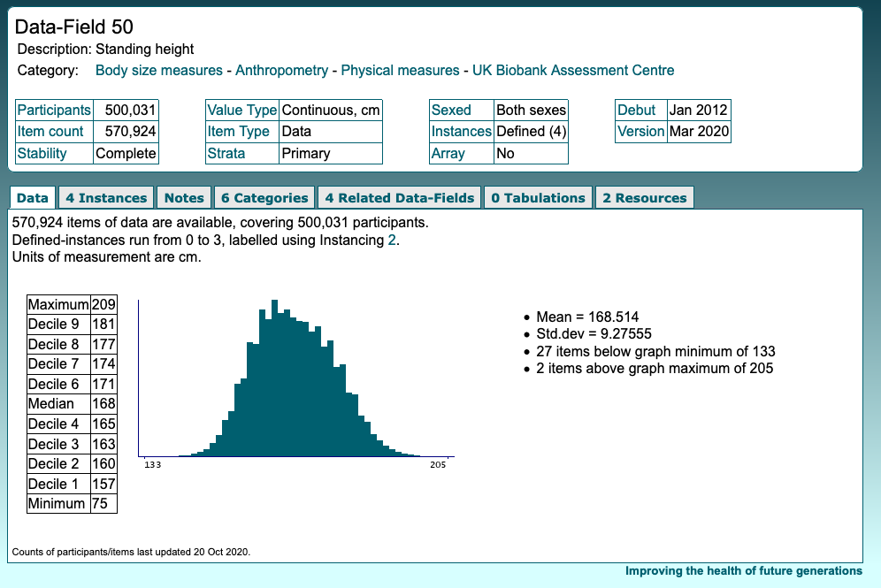
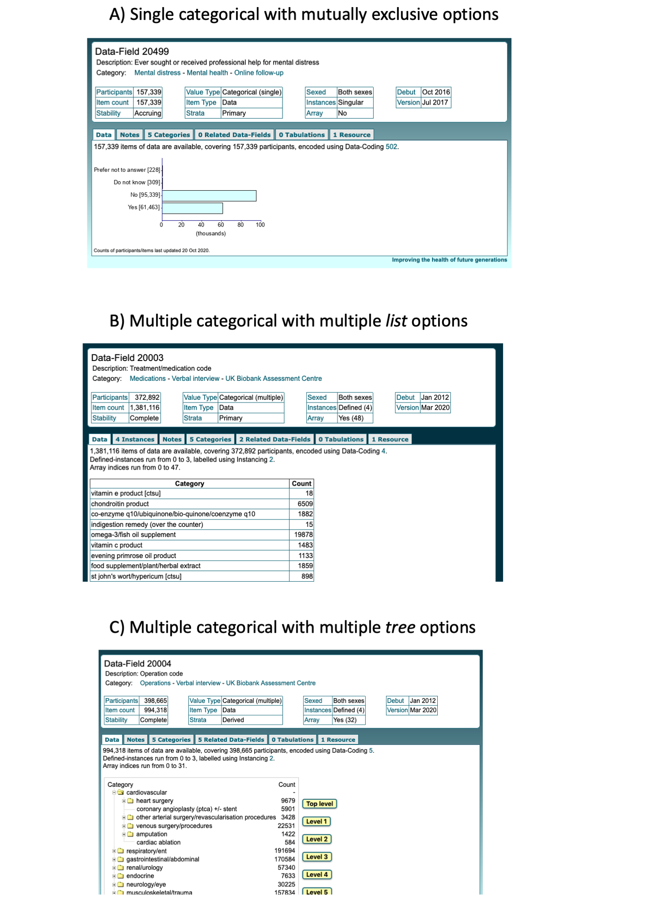
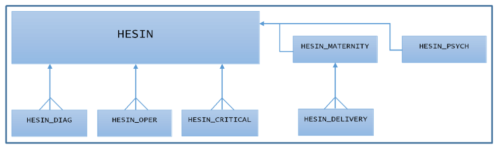

# Understanding UK Biobank showcase data

The best way to get familiar with the data available in UK Biobank is to browse their [data showcase](https://biobank.ctsu.ox.ac.uk/crystal/browse.cgi). You can also [search](http://biobank.ctsu.ox.ac.uk/crystal/search.cgi) for specific fields or keywords.

## Structure of the main dataset

A main, single UKB dataset contains all the fields included in the approved application. Since the main UKB dataset can be a very large file (17-70GB depending on file extension) not efficient to work with, the dataset available in Minerva is split in multiple, smaller .tab files.

For each .tab file, each individual is a row, and the data fields are the variable names (in the format *f.XXXXX.X.X*). 
The individual IDs are coded in the field “f.eid” and are application specific. *It is important to note that individual’s id numbers will be different for each application.* Table 1 provides an example of how a .tab file would like for three hypothetic phenotypes/fields.

| f.eid   | &nbsp; f.22040.0.0 &nbsp; | &nbsp; f.42038.0.0 &nbsp; | &nbsp; f.42037.0.0 &nbsp; |
|---|---|---|---|
| 5967229 | NA | 1   | 23  |
| 4674807 | NA | NA| NA|
| 1456203 | 3330| 2| 575|
| 3723112 | NA| 1| 380|

 
**Table 1.** Example of .tab file for three phenotypes. Each row is a participant and the f.eid field contains the application-specific participant ID. Each field is a column, coded following the format *f.XXXXX.X.X*.

## Format of data fields in UK Biobank 

A data-field is the fundamental block of data held within the UK Biobank. It identifies the results of a question, measuremen or result. For more information about data fields and their basic properties, visit the [official UK Biobank documentation](https://biobank.ctsu.ox.ac.uk/crystal/help.cgi?cd=data_field).

Data fields in UK Biobank present the following structure:

f.XXXXX.X.X

where the different colors represent basic properties of the field, namely:

f.field.instance.array

 

- **Field:** The field number uniquely identifies the question, measurement or result in the data showcase.
- **Instance:** The [instance](https://biobank.ctsu.ox.ac.uk/crystal/instance.cgi?id=2) refers the assessment instance or visit. All participants attended an initial assessment centre (instance = 0), but a proportion were also invited several years later to repeat some of the assessments (instances 1 to 3). 
- **Array:** The [array](https://biobank.ctsu.ox.ac.uk/crystal/help.cgi?cd=array) captures multiple answers that may be given to the same question.

Following the example in Table 1, the three fields (f.22040, f.42038 and f.42037) refer to the initial assessment visit (Instance = 0) and only one item of data is present for each participant (array = 0). A colour coded version of the previous .tab file example is presented in Table 2.

| f.eid   | &nbsp; f.22040.0.0 &nbsp; | &nbsp; f.42038.0.0 &nbsp; | &nbsp; f.42037.0.0 &nbsp; |
|---|---|---|---|
| 5967229 | NA | 1   | 23  |
| 4674807 | NA | NA| NA|
| 1456203 | 3330| 2| 575|
| 3723112 | NA| 1| 380|

 
**Table 2.** Colour coded version example of .tab file for three phenotypes. 

The following subsections present two specific examples of a field with multiple instances (standing height), and a field with multiple arrays (treatment medication). 

### Example of field with multiple instances - Standing height 

Standing height ([field number 50](https://biobank.ndph.ox.ac.uk/showcase/field.cgi?id=50)) was measured 4 times. Therefore you would see in your .tab file 4 columns as presented in Table 3.

| f.eid   | &nbsp; f.50.0.0. &nbsp; | &nbsp; f.50.1.0. &nbsp; | &nbsp; f.50.2.0. &nbsp; | &nbsp; f.50.3.0. &nbsp; |
|---|---|---|---|---|
| 5967229 | 156.0| 155.9| 156.0| 156.0|
| 4674807 | 178.3| 178.3| 178.3| 178.2|
| 1456203 | 175.8| 175.8| 175.8| 175.8|
| 3723112 | 161.0| 161.0| 161.0| 161.0|

 
**Table 3.** Standing height measurements in four UK Biobank participants. Instance number is highlighted in red: Instance = 0 corresponds to the initial assessment visit (2006-2010), instance = 1 corresponds to the first repeat assessment visit (2012-13), instance = 2 corresponds to the imaging visit (2014+), and instance = 3 corresponds to first repeat imaging visit (2019+). 

!!! note
    Because the data was measured multiple times, there can be variations across instances due to measurment error or variations over time (Note the variation in Table 3 for the first two participants). 

### Example of field with multiple arrays - Treatment medication

Information about treatment medication ([field number 20003](https://biobank.ctsu.ox.ac.uk/crystal/field.cgi?id=20003)) was measured 4 times (therefore it has 4 instances). 
For each instance, participants indicated how many medications they were taking. Each medication would be recorded as a new item and will be stored as a new variable. 

The maximum number of items present for any participant will define the number of variables available for that field. 
For example, if there is a person who recorded 47 items for treatment medication, there will be 47 variables/instances for this field (Table 4). 

| f.eid   |&nbsp;f.20003.0.1 &nbsp; | &nbsp; f.20003.0.2 &nbsp; | &nbsp; f. 20003.0.3 &nbsp; | &nbsp; … |&nbsp; f. 20003.0.47 &nbsp; |
|---------|-------------|-------------|--------------|----|---------------|
| 5967229 | NA          | NA          | NA           | … | NA            |
| 4674807 | 178         | 1754        | NA           | … | NA            |
| 1456203 | 45          | NA          | NA           | … | NA            |
| 3723112 | 1341        | 161         | 131          | … | 14            |

 
**Table 4.** Treatment medication results in four UK Biobank participants. Array number is highlighted in red. As there was one person (participant ID 3723112 in this example) reporting 47 different treatment/drugs, 47 columns are related to each instance in the .tab file. 

The numeric values represent categories or values to code medical treatments. Further information about data-coding for categorical variables is included in the next section. For details on this specific data-coding, click [here](https://biobank.ctsu.ox.ac.uk/crystal/coding.cgi?id=4).

Other examples of fields with multiple arrays are self reported [cancer illness](https://biobank.ctsu.ox.ac.uk/crystal/field.cgi?id=20001) and [non-cancer illness](https://biobank.ctsu.ox.ac.uk/crystal/field.cgi?id=20002) codes obtained during the verbal interview of the UK Biobank Assessment Centre. 

## Value types in UK Biobank 

The 'Value type' information contained in a data field describes the type of variable (e.g. categorical, continuous, time, date etc.) for that field. There are [9 categories of value types](https://biobank.ndph.ox.ac.uk/ukb/help.cgi?cd=value_type) in UK Biobank, but here we will focus on continuous and categorical categories, as these are the ones most frequently used.   

### Integer and continuous 

Integer value types correspond to whole numbers, for example the age of a participant on a particular date. 
Continuous value types are floating-point numbers, for example the height of a participant (Table 5). 

| f.eid   | &nbsp; f.50.0.0| &nbsp; f.50.1.0 &nbsp; | &nbsp; f.50.2.0. &nbsp; | &nbsp; f.50.3.0. &nbsp; |
|---|---|---|---|---|
| 5967229 | 156.0| 155.9| 156.0| 156.0|
| 4674807 | 178.3| 178.3| 178.3| 178.2|
| 1456203 | 175.8| 175.8| 175.8| 175.8|
| 3723112 | 161.0| 161.0| 161.0| 161.0|

 
**Table 5.** Standing height measurements in four UK Biobank participants, as example of a continuous variable. 

Usually a histogram, deciles, minimum and maximum, and basic summary statistics (mean, std. dev) are included in the 'Data' tab of each data field (Figure 1). We recommend to always check this information before running any analysis.

**Figure 1.** Illustration of a data field page (Standing height). *Source:* [UK Biobank](https://biobank.ndph.ox.ac.uk/ukb/field.cgi?id=50).

### Categorical 

A large proportion of the data data-fields within the UK Biobank repository are categorical. They can be *single categorical*, when a single answer is selected from a coded list or tree of mutually exlusive options, for examples a yes/no choice (Figure 2-A), or *multiple categorical*, when sets of answers are selected form a coded list (Figure 2-B) or tree of options (Figure 2-C).

**Figure 2.** Examples of three categorical data fields with A) mutually exclusive options (field [20499](https://biobank.ctsu.ox.ac.uk/crystal/field.cgi?id=20499)), B) mutually list options (field [20003](https://biobank.ctsu.ox.ac.uk/crystal/field.cgi?id=20003)), and C) multiple tree options (field [20004](https://biobank.ctsu.ox.ac.uk/crystal/field.cgi?id=20004)). 

### Data-coding of categorical data 

*Source: [UK Biobank documentation](https://biobank.ndph.ox.ac.uk/ukb/help.cgi?cd=data_coding)*

A data-coding is a mapping between the actual data and the values used to represent it within the database. For example, for the question [Country of birth](https://biobank.ctsu.ox.ac.uk/crystal/field.cgi?id=1647), the value 1 represents "England", whereas value 2 represents "Wales".

Similar to the two types of categorical values, there are two structures of data coding:

- **Flat**: the data-coding is a list of values with no ordering or relationship between them.
- **Tree**: the data-coding is a set of values which represent some sort of tree hierarchy, allowing an answer to be specified to whatever level of detail is known.

!!! Important
    Before using any data field, it is good practice to check whether the values of the field use any data-coding mapping. If that is the case, users might want to replace the values with their actual meaning. Further details can be found in the Phenotype extraction section. 

Apart from their use in interpreting the values of a data-field, a data-coding also shows the range of answers/alternatives that were available when an item of data was entered -the data-coding may include alternatives that do not appear in the final dataset because they were not applicable to any participants in UK Biobank.

## Health Records Linkage

UK Biobank follows up participant's health through linkage to medical records. Upon joining UK Biobank, participants sign a consent form to allow UK Biobank to access their medical and other health-related records for research purposes. Additionally, UK Biobank has routinely linked to national death and cancer registries and to national hospital data electronic record systems for all its participants since 2010.

### Hospital inpatient episodes

Inpatient hospital data for the UK Biobank cohort contains information on when a particular diagnosis or procedure was recorded in the hospital data. This information was obtained through linkage to external data providers. 
Inpatients are defined as persons who are admitted to hospital and occupy a hospital bed. Diagnoses are coded according to the World Health Organization’s International Classification of Diseases and Related Health Problems (Both [ICD-10](https://biobank.ctsu.ox.ac.uk/crystal/field.cgi?id=41270) and [ICD-9](https://biobank.ctsu.ox.ac.uk/crystal/field.cgi?id=41271) codes are available). All operations and procedures are coded according to the Office of Population, Censuses and Surveys [(OPCS)](https://biobank.ctsu.ox.ac.uk/crystal/field.cgi?id=41272). Click [here](https://biobank.ndph.ox.ac.uk/ukb/ukb/docs/HospitalEpisodeStatistics.pdf) for more details on the UK Biobank Hospital inpatient data.

**Due to the format and complexity of the record-level data, data on Hospital inpatient episodes is not provided as part of the main UK Biobank dataset but as separate data tables**. 
It is also important to note that the hospital inpatient data is available to researchers in two formats: summary and record-level data. Detailed explanations about data collection and the two data formats available can be found [here](https://biobank.ndph.ox.ac.uk/ukb/label.cgi?id=2000).

#### Record-level inpatient data
Record level inpatient data is divided into seven interrelated database tables. The core table is "hesin", which connects to the subsidiary tables via a "record_id" field.

<figcaption> Figure. Record-level data is split in seven interrelated data tables. Figure obtained from UK Biobank website.</figcaption>

The hesin table provides information on inpatient episodes of care for England, Wales and Scotland, including details on admissions and discharge, the type of episode and -where applicable- how an episode fits into a hospital spell (that is, the full time a patient spends in hospital from admission to discharge).

Below there is an example of how a *hesin* table looks like. For a hesin table, the same individual (eid) can appear more than once, but each inpatient episode (record_id) for a participant is stored as a single record, i.e. a row of data. **This differs from the format of the UK Biobank main dataset, which provides a single row of data per participant**.

|     eid|record_id    |     admidate      |     diag_icd10    |     disdate       |     epiend        |     epistart      |     opdate        |     oper4    |
|----------------|------------------|-------------------|-------------------|-------------------|-------------------|-------------------|-------------------|--------------|
|     1234567    |     9073133      |     2003-05-11    |     R198          |     2003-05-15    |     2003-05-15    |     2003-05-15    |                   |     X948     |
|     1234567    |     1195874      |     2003-07-05    |     R104          |     2003-06-05    |     2003-06-05    |     2003-06-05    |     2003-06-05    |     H151     |
|     6467723    |     1134531      |     2000-02-01    |                   |     2000-05-01    |     2000-05-01    |     2000-05-01    |                   |     X668     |
|     5123456    |     3345750      |     2006-09-16    |     L720          |     2006-05-16    |     2006-05-16    |     2006-05-16    |     2006-05-16    |     S045     |
|     5123456    |     2343109      |                   |     M8414         |                   |     2005-10-05    |     2005-10-05    |     2005-10-05    |     W200     |
|     5123456    |     4223415      |                   |     M8414         |                   |     2005-10-05    |     2005-10-05    |     2005-10-05    |     W231     |

&nbsp;

#### Summary-level hospital inpatient data

UK Biobank has also created summary fields that provide the first date of any given diagnostic or operation code, which may be sufficient for many researchers’ needs. More information about summary-level hospital inpatient data can be found [here](https://biobank.ctsu.ox.ac.uk/crystal/label.cgi?id=2000).

### Primary care (To do)

### Death registrations (To do)

### Cancer registrations (To do)

### Algorithmically-defined outcomes (To do)

### First occurrences (To do)

### COVID-19 (To do)
