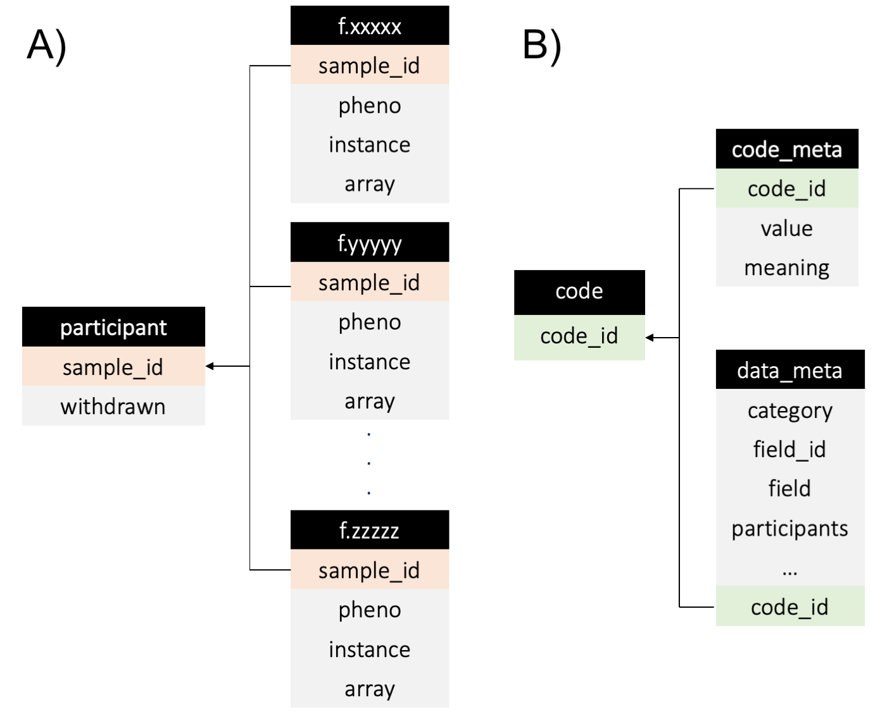

# Phenotype extraction - SQL

There are many advantages of using the SQL database instead of the [plain text phenotype files](tradition.md). 
The most important advantage is that with the SQL database phenotypes can be extracted using scripts that refer to the unique phenotype field IDs, improving reproducibility. 
In addition, data inside the SQL database is indexed, which allows quicker access to the data. 

The main disadvantage of using the SQL database is that it requires some knowledge of SQL language, which can be difficult for new comers. To overcome this issue, this document gives and overview of the basic structure of the SQL database and provides example SQL scripts to get well-acquainted with the SQL database. 

!!! note

    To access the database, you must have [sqlite3](https://sqlite.org/index.html) installed. Click [here](https://www.sqlitetutorial.net/) for a description and tutorial on SQLite.

## Database Structure 
To use the SQL database we must first understand the basic structure of a [relational database](https://en.wikipedia.org/wiki/Relational_database), where each table is a file on its own. The relationships between tables/files are established through 'keys'. Depending on their role, keys are defined as [primary](https://en.wikipedia.org/wiki/Primary_key) or [foreign](https://en.wikipedia.org/wiki/Foreign_key). In brief, *primary keys* are a set of attributes in a table (e.g. one or more columns) that uniquely identifies rows in a given table, whereas *foreign keys* are a set of attributes that refers to the primary key of another table. The foreign key links the two tables.

In our UK Biobank SQL database, each phenotype is contained in one table with name `fxxxx` (where `xxxx` is the field ID of the phenotype). The `fxxxx` tables are all linked to a 'participant' table through the sample_id field, which contains information about participant withdrawal (Figure below, panel A). 

As discussed in the [previous section](./data_manipulation.md), a large proportion of the data fields within the UK Biobank repository are categorical and use data-coding to map the actual data and the values used to represent it within the database. To include the data-coding matching in the SQL scripts for phenotype extraction, the data-coding tables need to be considered in the SQL script. The structure of these tables are represented in the Figure below, panel B.



<br>

Detailed descriptions of the different data tables within our SQL database can be found in the following table:

<table>
<th colspan="4">
Participant
</th>
<tr>
    <td>sample_id</td>
    <td>ID of UKB Samples</td>
    <td>int</td>
    <td>primary key in this table</td>
</tr>
<tr>
    <td>withdrawn</td>
    <td>Number represent if sample withdrawn consent. 1 for yes, 0 for no</td>
    <td>int</td>
    <td></td>
</tr>
<th colspan="4">
fxxxx (where xxxx is the field ID of the phenotype)
</th>
<tr>
    <td>sample_id</td>
    <td>ID of UKB Samples</td>
    <td>int</td>
    <td>primary key in this table</td>
</tr>
<tr>
    <td>pheno</td>
    <td>The phenotype</td>
    <td>text</td>
    <td></td>
</tr>
<tr>
    <td>instance</td>
    <td>0 for baseline measurement, 1 for first follow up, so and so forth</td>
    <td>int</td>
    <td></td>
</tr>
<tr>
    <td>array</td>
    <td>0 for first reported item, 1 for the second, so and so forth. This field is only presented for phenotypes that allow multiple input</td>
    <td>int</td>
    <td></td>
</tr>
<th colspan="4">
code
</th>
<tr>
    <td>code_id</td>
    <td>Data-coding ID</td>
    <td>int</td>
    <td></td>
</tr>
<tr>
    <td>value</td>
    <td>The Data-coding</td>
    <td>int</td>
    <td></td>
</tr>
<tr>
    <td>meaning</td>
    <td>Meaning of the Data-coding</td>
    <td>text</td>
    <td></td>
</tr>
<th colspan="4">
data_meta
</th>
<tr>
    <td>category</td>
    <td>Category ID</td>
    <td>int</td>
    <td></td>
</tr>
<tr>
    <td>field_id</td>
    <td>Unique Field ID</td>
    <td>int</td>
    <td>primary key</td>
</tr>
<tr>
    <td>field</td>
    <td>Description of the field</td>
    <td>TEXT</td>
    <td></td>
</tr>
<tr>
    <td>participants</td>
    <td>Number of participant with this phenotype</td>
    <td>int</td>
    <td></td>
</tr>
<tr>
    <td>items</td>
    <td>Number of items in this phenotype</td>
    <td>int</td>
    <td></td>
</tr>
<tr>
    <td>stability</td>
    <td>Indicate if this phenotype is table</td>
    <td>text</td>
    <td></td>
</tr>
<tr>
    <td>value_type</td>
    <td>Indicate the type of phenotype</td>
    <td>text</td>
    <td></td>
</tr>
<tr>
    <td>units</td>
    <td>The units of which the phenotype is measured in (if any)</td>
    <td>text</td>
    <td></td>
</tr>
<tr>
    <td>item_type</td>
    <td>Type of items, e.g. data, bulk, etc.</td>
    <td>text</td>
    <td></td>
</tr>
<tr>
    <td>strata</td>
    <td>e.g. Primary, auxiliary</td>
    <td>text</td>
    <td></td>
</tr>
<tr>
    <td>sexed</td>
    <td>Inidicate if this phenotype is only measured in male, female, or is unisex</td>
    <td>text</td>
    <td></td>
</tr>
<tr>
    <td>instances</td>
    <td>Indicate the number of repeated measure for this phenotype</td>
    <td>int</td>
    <td></td>
</tr>
<tr>
    <td>array</td>
    <td>For phenotype that allow multiple responses (e.g. ICD10), this indicate the maximum number of response. </td>
    <td>int</td>
    <td></td>
</tr>
<tr>
    <td>code_id</td>
    <td>Data-coding used for this phenotype</td>
    <td>int</td>
    <td>foreign (code:code_id)</td>
</tr>
<tr>
    <td>included</td>
    <td>If this application has permission to access this phenotype. 1 = "yes"</td>
    <td>int</td>
    <td></td>
</tr>
</table>
<br>

## Using the SQL database
Basic understand of the SQL language is required to efficiently use our SQL database. 
We recommend to write down the SQL commands in a `.sql` file and use the SQL database as follows:

```bash
sqlite3 ukb<ID>.db < command.sql
```

where `command.sql` is the sql command file containing the following header:

``` sql
.header on
.mode csv
.output <name>.csv
```

!!! Note
    Useful basic SQL commands used in the SQL scripts:

    - Command FROM and JOIN --> indicate the tables that we are going to use

    - Command SELECT --> indicates the columns that we select

    - Command WHERE --> indicates the rows that we select 


Below we provide users with the same tree examples that we used in the [Phenotype extraction - Plain text](./tradition.md) section, but here we extract the phenotypes using the SQL database:


## Example 1: Basic usage

In the 'Basic usage' section, we present an example on how to extract the first instance of the phenotype 'Height' (f.50.0.0) from UK Biobank.

``` sql
.header on
.mode csv
.output Height.csv 	-- Output to file named Height.csv

SELECT  s.sample_id AS FID, 	-- select sample_id from table 's' and call it FID 
        s.sample_id AS IID, 	-- select sample_id from table 's' and call it IID
        age.pheno AS Age, 		-- select pheno from table 'age' and call it Age
        sex.pheno AS Sex, 		-- select pheno from table 'sex' and call it Sex
        bmi.pheno AS BMI, 		-- select pheno from table 'bmi' and call it BMI
        centre.pheno AS Centre 	-- select pheno from table 'centre' and call it Centre

FROM    Participant s 		 	-- using table 'participant', now named as 's'
        JOIN    f21001 bmi ON 
                s.sample_id=bmi.sample_id   -- join the BMI table by sample ID
                AND bmi.instance = 0        -- only getting the baseline phenotype
        JOIN    f31 sex ON
                s.sample_id=sex.sample_id   -- join the Sex table by sample ID
                AND sex.instance = 0        -- only getting the baseline phenotype
        JOIN    f21003 age ON 
                s.sample_id=age.sample_id   -- join the Age table by sample ID
                AND age.instance = 0        -- only getting the baseline phenotype
        JOIN    f54 centre ON 
                s.sample_id=centre.sample_id -- join the UKB assessment centre table by sample ID
                AND centre.instance = 0      -- only getting the baseline phenotype
         WHERE   s.withdrawn = 0;             -- Exclude any samples who withdrawn their consent
.quit
```

## Example 2: Phenotypes with data-coding

In this section we present an example of a field with categorical values encoded by UK Biobank. 

``` sql
.header on
.mode csv    
.output NumDepress.csv 		-- Output to file named NumDepress.csv 

-- The following code creates a temporary table named `pheno_code` containing
-- code.value and code.meaning for all the entries with 
-- data_meta.field_id=20442:

CREATE TEMP TABLE pheno_code
AS
SELECT	cm.value AS value,	    -- select value from table 'cm' and call it value
        cm.meaning AS meaning	-- select meaning from table 'cm' and call it meaning
FROM    code cm		            -- using table 'code', now named as cm
JOIN    data_meta dm ON 
        dm.coding=cm.code_id
WHERE   dm.field_id=20442;      

-- The following code creates a dataset that joins
-- table participant (called s), and table f20442 where withdrawn=0 & instance=0
-- for each row in the new dataset:
--		FID=s.sample_id
--		IID=s.sample_id
--		if Meaning isn't null, use meaning as phenotype, 
--		else Pheno = f20442.pheno

SELECT      s.sample_id AS FID,
            s.sample_id AS IID,
            COALESCE(
                pheno_code.meaning, 
                depress.pheno) AS Pheno -- use first non-null / empty item as phenotype
FROM        f20442 depress
JOIN        Participant s

-- Join pheno_code into depress, meaning will be an empty string if 
-- the phenotype is not presented as a value in pheno_code (LEFT JOIN)

LEFT JOIN   pheno_code ON        
            pheno_code.value=depress.pheno 
WHERE       depress.instance=0 AND
            s.sample_id = depress.sample_id AND
            s.withdrawn = 0;
.quit
```

## Example 3: Phenotypes from Health Records Linkage


In the 'Phenotypes from Health Records Linkage' section, we present an example on how to extract information from Health Records, using the ICD-10 coding 


```sql
.header on
.mode csv    
-- Output to file named scz.csv 
.output scz.csv 
 
SELECT  s.sample_id AS FID, 
        s.sample_id AS IID,
        (CASE WHEN s.sample_id IN
            (
                SELECT  xx.sample_id
                FROM    f41270 as xx
                WHERE   pheno LIKE '"F20_"' -- with this you dont need to creat a SCZ table
                        AND instance=0
                        AND s.sample_id=xx.sample_id
            )
            THEN 1          -- samples found in scz table are cases (1)
            ELSE 0
        END) AS Pheno
FROM    Participant s 
WHERE   s.withdrawn= 0;     -- Exclude any samples who withdrawn their consent
.quit
```

!!! Note
    There are two wildcards used in conjunction with the `LIKE` operator −

    - The percent sign (`%`): 0, 1 or multiple numbers of characters
    - The underscore (`_`)  : single number of character

    For ICD10, remember to include the double quotes: `'"XXXX"'`

